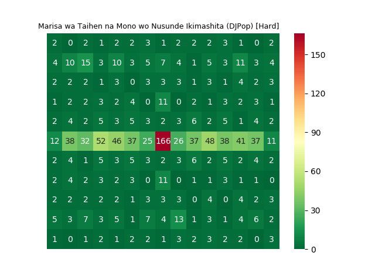
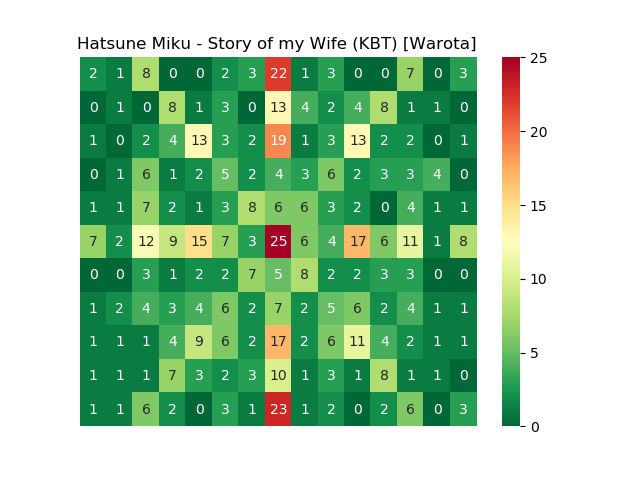
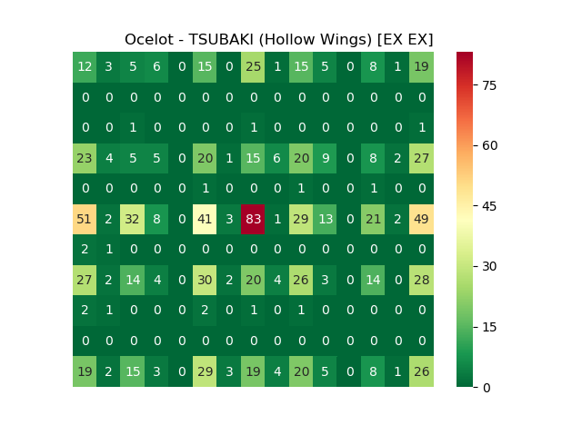
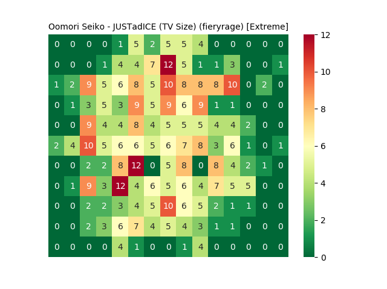

# OsuMapToHeatmap

Visualize a map with a heatmap!

## How to use it
1. install packages in requirements.txt
1. Run plot.py, and input the path of .osu file (either absolute or relative)

## Heatmaps Gallery

    
Click to expand

__▲ [IOSYS - Marisa wa Taihen na Mono wo Nusunde Ikimashita (DJPop) \[Hard\]](https://osu.ppy.sh/beatmapsets/243)__

__▲ [Hatsune Miku - Story of my Wife (KBT) \[Warota\]](https://osu.ppy.sh/beatmapsets/35773)__

__▲ [The Quick Brown Fox - The Big Black (Blue Dragon) \[WHO'S AFRAID OF THE BIG BLACK\]](https://osu.ppy.sh/beatmapsets/41823)__

__▲ [Ocelot - TSUBAKI (Hollow Wings) \[EX EX\]](https://osu.ppy.sh/beatmapsets/364574)__

__▲ [Oomori Seiko - JUSTadICE (TV Size) (fieryrage) \[Extreme\]](https://osu.ppy.sh/beatmapsets/983942)__

## TODO
* Lengthen bezier curve