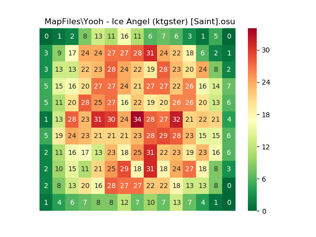

# OsuMapToHeatmap

Visualize a map with a heatmap!

## How to use it
1. install packages in requirements.txt
1. Run plot.py, and input the path of .osu file (either absolute or relative)

## TODO
* Lengthen bezier curve
